# PayRecon

A payment reconciliation & settlement engine — a portfolio project modeling how a real fintech backend ingests payment-gateway webhooks, reconciles them against internal order records, books a double-entry ledger, reconciles a second time against bank settlement files, and surfaces all of it through both an API and an operator dashboard. Built as four independently deployable services (three backend, one frontend) in an npm-workspaces monorepo, all runnable on free-tier infrastructure.

## Architecture

```mermaid
flowchart LR
    subgraph Browser
        DASH[Dashboard SPA<br/>React + Vite, served via nginx]
    end

    subgraph MG["mock-gateway (Fastify)"]
        SIM[Simulation service<br/>random delay / failure / pending / duplicate]
    end

    subgraph ING["ingestion (Fastify)"]
        ORD[Orders API]
        WH[Webhook intake<br/>HMAC verify + idempotency]
        STATS[Stats / dashboard API]
        LEDGER[Ledger API<br/>entries + trial balance]
        SETTLE[Settlements API<br/>CSV upload + batch matching]
        DOCS[Swagger UI /docs]
    end

    subgraph WRK["reconciliation-worker"]
        CONS[Stream consumer<br/>consumer group + distributed lock]
        REC[reconcile&#40;&#41; — pure matching logic]
        LEDGERFN[createLedgerEntries&#40;&#41;<br/>pure double-entry logic]
        RETRY[Retry scheduler<br/>sorted-set backoff]
    end

    PG[(Postgres<br/>orders, payment_events, mismatches,<br/>dead_letter_events, ledger_entries,<br/>settlement_batches/records)]
    R[(Redis<br/>idempotency keys, streams,<br/>distributed locks, retry schedule)]

    DASH -.->|CORS| ORD
    DASH -.->|CORS| SIM
    DASH -.-> STATS
    DASH -.-> LEDGER
    DASH -.-> SETTLE

    SIM -.->|async, signed webhook<br/>+ retries + duplicates| WH
    WH -->|SETNX idempotency check| R
    WH -->|upsert PaymentEvent| PG
    WH -->|XADD payment-events| R
    ORD --> PG
    STATS --> PG
    LEDGER --> PG
    SETTLE -->|match against PaymentEvent,<br/>flip LedgerEntry to SETTLED| PG
    R -->|XREADGROUP| CONS
    CONS -->|lock payment-event:id| R
    CONS --> REC
    REC -->|update Order status,<br/>write Mismatch rows| PG
    REC -->|on PAID / REFUNDED| LEDGERFN
    LEDGERFN -->|balanced debit/credit pair,<br/>same DB transaction| PG
    CONS -.->|failure: schedule| RETRY
    RETRY -.->|due: XADD requeue| R
```



**Why three backend services, not one monolith:** ingestion must respond to webhooks fast (ack pattern) and shouldn't block on reconciliation logic; the worker needs independent horizontal scaling and its own retry/backoff loop; the mock gateway needs to simulate an external, unreliable third party, which only makes sense as a genuinely separate process.

**Why a fourth service for the dashboard, not folded into ingestion:** it's a static SPA build (`vite build` → nginx), a fundamentally different deployment artifact than the three Fastify/Node services — bundling it into ingestion would mean shipping a browser bundle and a Node server from the same container image for no operational benefit.

**Two reconciliations, not one:** the webhook path (ingestion → worker) answers "did the gateway *tell us* this payment succeeded?" — but a webhook is the gateway's word, not proof money moved. The settlement-file path (bank statement CSV → `/settlements`) answers the second, independent question: "does the bank's own T+1 record agree?" A `LedgerEntry` only becomes `SETTLED` once both have agreed — this two-sided check is exactly how real payment/banking infra reconciles, not a simplification of it.

## Tech stack & why

| Concern | Choice | Why |
|---|---|---|
| Framework | Fastify 5 | Built-in schema-based serialization, first-class TS, encapsulated plugin system (used deliberately for the raw-body webhook parser) |
| Database | PostgreSQL + Prisma | Relational integrity (FK constraints actively used — see Design Decisions) + generated types |
| Cache/queue/locks | Redis (ioredis) | One dependency covers idempotency (SETNX), the queue (Streams), and distributed locks (SET NX PX) — see below on why not Kafka |
| Queue | Redis Streams | Consumer groups give at-least-once delivery + per-consumer pending-entry tracking without a second piece of infrastructure. Upstash Kafka would mean a second free-tier account and stricter message caps for no capability this project actually needs |
| Validation | Zod | Runtime validation with inferred static types, one schema for both |
| Bundling | esbuild | Internal packages (`@payrecon/shared`, `@payrecon/db`) ship raw TypeScript with no build step, for zero-friction local dev via `tsx`. esbuild inlines that source into a single file for the Docker production build — see Design Decisions |
| Tests | Vitest | Faster startup than Jest, native TS/ESM, Jest-compatible API |
| Frontend | React + Vite + TypeScript, TanStack Query, react-router-dom | A small operator dashboard, not a customer-facing app — Vite's dev-server speed and zero-config TS matter more here than a metaframework. TanStack Query polls every 2-3s rather than pushing over SSE/WebSockets: this system already has multi-second inherent latency (mock-gateway's simulated delay, retry backoff), so push buys no visible responsiveness for the cost of a second protocol and its own connection-lifecycle bugs |
| CSV parsing | csv-parse | Settlement-file ingestion — a well-known, well-typed library beats hand-rolling quote/escape/CRLF handling for a feature meant to demonstrate real-world reconciliation, not parser trivia |

## Repository layout

```
packages/
  shared/    # errors, logger, config loader, zod schemas, HMAC, Redis client, queue types
  db/        # Prisma schema + generated client singleton + dev-only demo-settlement-CSV script
services/
  mock-gateway/           # simulates the payment provider
  ingestion/              # orders/webhook/ledger/settlements/stats APIs, Swagger docs
  reconciliation-worker/  # stream consumer, matching logic, double-entry ledger booking, retries, dead-letter queue
  dashboard/              # React/Vite operator dashboard — orders, ledger, mismatches, settlements
```

Each service follows the same layered structure: `routes → controllers → services → repositories`, with a `buildApp(env)` composition root (see `services/*/src/app.ts`) that constructs every dependency once and threads it through closures — nothing reaches for a module-level singleton, which is what makes the integration tests able to spin up a fully wired app against a real test database.

## Setup

### 1. Prerequisites
- Node.js 20+
- Docker Desktop (for local Postgres/Redis, and to run the full stack in containers)

### 2. Local development

```bash
npm install
cp .env.example .env          # generate your own WEBHOOK_HMAC_SECRET, see comment in the file
docker compose up -d postgres redis
npm run db:migrate            # applies packages/db/prisma/migrations
```

Run each service in its own terminal:

```bash
npm run dev:ingestion          # http://localhost:3000  (Swagger UI at /docs)
npm run dev:mock-gateway       # http://localhost:4000
npm run dev:worker             # http://localhost:4100 (health only; the worker itself has no HTTP API)
npm run dev:dashboard          # http://localhost:5173
```

Try the flow:

```bash
curl -X POST http://localhost:3000/orders -H "Content-Type: application/json" \
  -d '{"amount": 5000, "currency": "USD"}'

curl -X POST http://localhost:4000/payments -H "Content-Type: application/json" \
  -d '{"orderId": "<id from above>", "amount": 5000, "currency": "USD"}'

# wait a few seconds for the mock gateway's simulated delay, then:
curl http://localhost:3000/stats
curl http://localhost:3000/ledger/balance   # should always net to zero
```

Or skip the curls entirely and drive the same flow from the dashboard at `http://localhost:5173` — create an order, trigger a payment, and watch Overview/Orders/Ledger update.

Try a settlement upload (the second, bank-statement-side reconciliation):

```bash
# --silent suppresses npm's own banner lines, which would otherwise get
# written into the redirected file ahead of the real CSV header
npm run --silent settlement:demo-csv --workspace=@payrecon/db > settlement.csv
curl -F "file=@settlement.csv;type=text/csv" http://localhost:3000/settlements
```

The generated CSV deliberately includes a matched row, an amount-mismatched row, and an unmatched row, so one upload demonstrates all three outcomes — check `/settlements/:id` (or the Settlements page) for the breakdown, and `/ledger` to see the matched entries flip from `PENDING_SETTLEMENT` to `SETTLED`.

### 3. Full stack via Docker

```bash
docker compose up -d --build
```

Brings up Postgres, Redis, and all four services, wired together on the compose network. Ingestion is on `:3000`, mock-gateway on `:4000`, the worker's health endpoint on `:4100`, the dashboard on `:5173`.

### 4. Tests

```bash
npm test                       # unit + integration, all workspaces
```

Integration tests run against the same docker-compose Postgres/Redis (real infra, not mocks) — they need `docker compose up -d postgres redis` and a migrated database first.

### 5. Free-tier services for production deployment

You'll need to sign up for and configure:
- **[Neon](https://neon.tech) or [Supabase](https://supabase.com)** (Postgres) → set `DATABASE_URL`
- **[Upstash](https://upstash.com)** (Redis) → set `REDIS_URL` (their `rediss://` TLS URL works directly with the `createRedisClient` factory in `packages/shared`)

No other paid infrastructure is required — Redis Streams (not a separate Kafka service) handles the queue.

If you deploy the dashboard somewhere other than `localhost:5173`, set `DASHBOARD_ORIGIN` on both ingestion and mock-gateway to that real origin (CORS is allow-listed, not wildcarded) and rebuild the dashboard with `VITE_API_BASE_URL`/`VITE_GATEWAY_BASE_URL` pointing at your deployed backend URLs — these are baked in at build time, not read at runtime.

## Design decisions

### Idempotency
Every webhook's `gatewayEventId` doubles as its idempotency key (mirroring how providers like Stripe key dedup off the event's own id). On receipt: `Redis SETNX key EX <ttl>` — first delivery wins and proceeds; a losing SETNX means "already seen," and the handler acks 200 immediately without reprocessing or re-publishing to the queue. This is the fast path (~1ms, no DB round trip), which matters because the endpoint must ack quickly.

A DB-level unique constraint on `gatewayEventId` backs this up for the case where a Redis key has TTL'd out before a genuine duplicate is redelivered — `PaymentEventRepository.upsertPending` is a Prisma `upsert`, not a `create`, so a late duplicate updates nothing rather than throwing.

### Why the FK column can be null
`PaymentEvent.orderId` has a real foreign-key constraint, which raises an interesting problem: the mock gateway can (and does) fire a webhook for an order that technically doesn't exist yet from the gateway's perspective of timing. Rather than reject the webhook, ingestion resolves `orderId` to `null` when the order isn't found yet (the intended order id still lives in `rawPayload`, unconstrained). The reconciliation worker re-resolves it from `rawPayload` on each attempt and backfills the column once the order shows up — this is what actually handles the "delayed order creation" out-of-order case, not just "delayed webhook."

### Distributed locking
Redis Streams consumer groups already guarantee each message is delivered to one consumer at a time, which should make locking redundant — but two things can still cause double-processing: `XCLAIM`/`XAUTOCLAIM` reassigning a message to a different consumer while the original is still mid-flight, or the retry scheduler (see below) re-publishing a message while an earlier attempt hasn't finished. `DistributedLock` (`SET key token PX ttl NX`, release via a compare-and-delete Lua script) closes that gap cheaply. It's insurance, not the primary concurrency-control mechanism.

### Retry strategy
Redis Streams has no native per-message delay — there's no way to say "redeliver this specific message in 8 seconds." Instead of leaving failed messages unacked in the stream's pending-entries list (which only supports a single idle-time threshold via `XCLAIM`, not independent per-message backoff), failures are acked immediately and the payment-event id is written into a Redis **sorted set** (`payrecon:retry-schedule`) with score = ready-at timestamp, computed via exponential backoff with jitter. A poller loop re-publishes due entries back onto the main stream. This gives every message its own independent backoff curve. After `RECONCILIATION_MAX_ATTEMPTS`, the event is written to `dead_letter_events` and marked `DEAD_LETTERED` instead of being rescheduled again.

### Reconciliation states
`PENDING` / `MATCHED` / `MISMATCHED` come out of the pure `reconcile()` function (`services/reconciliation-worker/src/services/reconciliation.service.ts`) — it never touches the database and is exhaustively unit tested. `FAILED` and `DEAD_LETTERED`, by contrast, are set by the *orchestration* layer (`StreamConsumer`) when processing itself throws (a DB outage, say) — they describe a failure to reach a verdict, not a business-level mismatch.

### Money as integer minor units
All amounts are stored and passed between services as integers (cents), never floats — the same approach Stripe uses. `packages/shared/src/money.ts` is the only place major/minor conversion happens.

### Double-entry ledger
Every payment event that `reconcile()` resolves to `PAID` or `REFUNDED` — i.e. `result.orderStatusUpdate` is set, not merely `state === MATCHED` — books two balanced `LedgerEntry` rows (debit `GATEWAY_RECEIVABLE`, credit `MERCHANT_PAYABLE`, same amount). This distinction matters: `reconcile()` also returns `MATCHED` for a legitimately-*failed* payment that moved no money (see `reconciliation.service.test.ts`), and booking ledger rows for that would silently violate the invariant `/ledger/balance` exists to prove holds. The booking logic itself (`services/reconciliation-worker/src/services/ledger.service.ts`) is a pure function — same shape and same unit-testing approach as `reconcile()` — and its two writes are wrapped in a single `prisma.$transaction` with the reconciliation-state update, since a persisted debit without its matching credit is the one place a partial write is a real correctness bug (the pre-existing mismatch/order-status writes are left outside the transaction; they're already tolerant of partial failure via retries).

v1 deliberately keeps to two accounts — a dedicated `FEE_REVENUE` account, or separate refund-payable accounting, are documented as future work, not missing features.

### Settlement reconciliation (bank statement files)
A settlement file is processed synchronously, inside the HTTP request (`SettlementService.processUpload`), not via a second Redis Streams pipeline — a deliberate scope decision. Uploads are a bounded, human-triggered, one-shot batch (dozens-hundreds of rows in practice), not the high-volume webhook path the queue infrastructure exists for; a background job would be more "production" for genuinely large files, but adds a second async pipeline for a case this system doesn't actually need to handle. Upload idempotency is by SHA-256 file hash (`SettlementBatch.fileHash`, unique) — re-uploading identical content returns the existing batch rather than reprocessing, mirroring the same "idempotency key on the thing itself" philosophy as the webhook path's `gatewayEventId`.

Per-record matching (`matchSettlementRecord`) is, again, a pure function: `MATCHED` / `AMOUNT_MISMATCH` / `UNMATCHED` from comparing the bank's reported amount/currency against the `PaymentEvent` looked up by `gatewayEventId`. A `MATCHED` record flips its corresponding `LedgerEntry` rows from `PENDING_SETTLEMENT` to `SETTLED` — this is the moment the system has *independent* confirmation (not just the gateway's webhook) that money actually moved.

### The dashboard: CORS and polling, not a BFF or push
`services/dashboard` calls ingestion and mock-gateway directly from the browser rather than through a backend-for-frontend — there's no aggregation or auth logic that would justify one. Both services register `@fastify/cors` scoped to a `DASHBOARD_ORIGIN` env var (default `http://localhost:5173`); mock-gateway needs it too, not just ingestion, since the Orders page's "trigger payment" action calls it directly. Data refreshes via TanStack Query polling every 2-3 seconds rather than a push channel (SSE/WebSockets) — see the Tech stack table for why push wasn't worth the added protocol and connection-lifecycle surface here.

### Why esbuild for the Docker build, but not for local dev
`@payrecon/shared` and `@payrecon/db` intentionally have no build step of their own (`package.json` `main` points straight at `src/index.ts`) — `tsx` executes TypeScript directly via the workspace's `node_modules` symlinks, so editing shared code hot-reloads consuming services with zero rebuild latency. Plain `node` in a production container can't do that (it can't parse `.ts`), so the Docker build stage bundles each service with esbuild instead, which inlines the internal packages' TypeScript source directly into one file. True npm packages that read their own files off disk at runtime — Prisma's native query engine, `@fastify/swagger-ui`'s bundled UI assets — are kept external from the bundle and supplied via a separate production-only `npm ci --omit=dev`, since bundling would silently break their `__dirname`-relative file access (see the comments in `services/ingestion/Dockerfile`).

## API documentation

Interactive Swagger UI is served by the ingestion service at `/docs` (`http://localhost:3000/docs` locally), with the raw OpenAPI 3.0 spec at `/docs/json`. Request validation is owned exclusively by the Zod schemas in each controller — the route-level schemas that power Swagger are response-only, so there's one source of truth for "is this input valid," not two validators that could disagree.

Full endpoint list:

| Method | Path | Service | Purpose |
|---|---|---|---|
| POST | `/orders` | ingestion | Create a mock order |
| GET | `/orders` / `/orders/:id` | ingestion | List / fetch orders |
| POST | `/webhooks/payments` | ingestion | Internal — HMAC-signed gateway webhook intake, not for direct manual use |
| GET | `/stats` / `/stats/mismatches` | ingestion | Reconciliation state counts / recent mismatches |
| GET | `/ledger` / `/ledger/balance` | ingestion | Ledger entries / trial balance (debits vs credits per account) |
| POST | `/settlements` | ingestion | Upload a bank settlement CSV for batch reconciliation |
| GET | `/settlements` / `/settlements/:id` | ingestion | List batches / batch detail with per-record match status |
| POST | `/payments` | mock-gateway | Simulate a gateway payment for an order |
| GET | `/health`, `/health/ready` | all services | Liveness / readiness (DB + Redis) |
